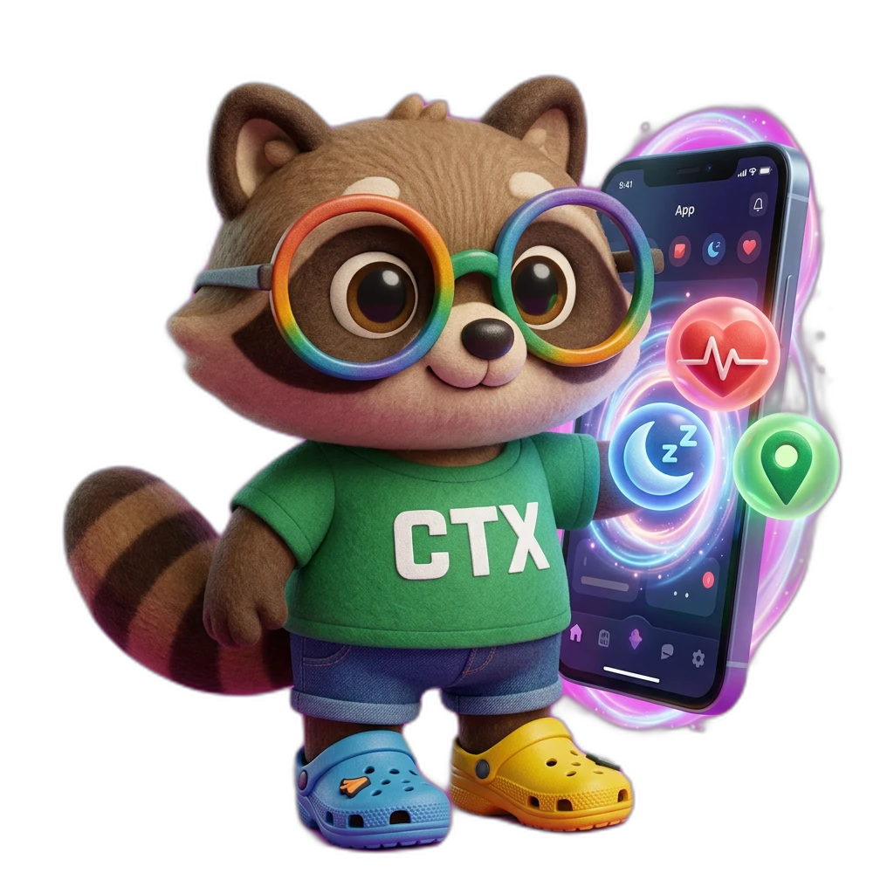
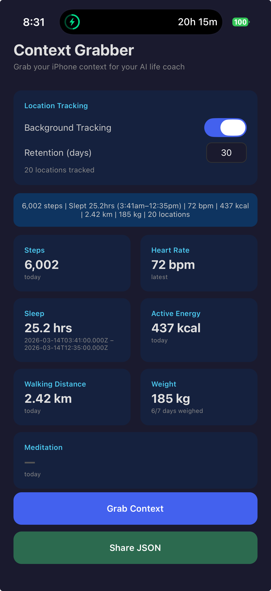

# Context Grabber



An iOS app that extracts health and location data from your iPhone and exports it as JSON — designed to give your AI life coach the context it needs.

<p align="center">
  
</p>

## What It Grabs

- **Steps** (today's total)
- **Heart rate** (most recent)
- **Sleep** (last night, with bedtime/wake time)
- **Active energy burned** (today's total)
- **Walking distance** (today's total)
- **Weight** (latest, with days weighed in last 7)
- **Meditation** (today's total minutes)
- **GPS location** (current)
- **Location history** (background tracking trail, stored in SQLite)

Hit "Grab Context" and share the JSON snapshot via the iOS share sheet — paste it into Claude, save to Files, AirDrop, whatever works.

## Tech Stack

- [Expo](https://expo.dev/) (SDK 55) + React Native + TypeScript
- [@kingstinct/react-native-healthkit](https://github.com/kingstinct/react-native-healthkit) for HealthKit access
- [expo-location](https://docs.expo.dev/versions/latest/sdk/location/) for foreground + background GPS
- [expo-sqlite](https://docs.expo.dev/versions/latest/sdk/sqlite/) for location history storage
- [expo-task-manager](https://docs.expo.dev/versions/latest/sdk/task-manager/) for background location tracking
- [EAS Update](https://docs.expo.dev/eas-update/introduction/) for OTA updates

## Setup

```bash
# Install dependencies
npm install

# Generate native iOS project
npx expo prebuild --platform ios

# Install CocoaPods
cd ios && pod install && cd ..

# Run on your iPhone (must be connected via USB)
npx expo run:ios --device
```

### Prerequisites

- **Node.js** (18+)
- **Xcode** (with iOS SDK)
- **Apple ID** signed into Xcode for code signing
- **Developer Mode** enabled on your iPhone (Settings > Privacy & Security > Developer Mode)

### Free Apple ID Limitations

With a free Apple ID (no $99/year developer program):
- Apps expire after **7 days** — redeploy from Xcode
- Limited to **3 sideloaded apps**
- No push notifications or CloudKit

## Related

Part of Igor's [side quests](https://idvork.in/side-quests) — lightweight tech explorations.
